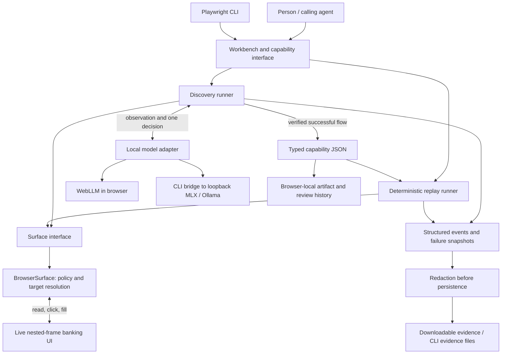
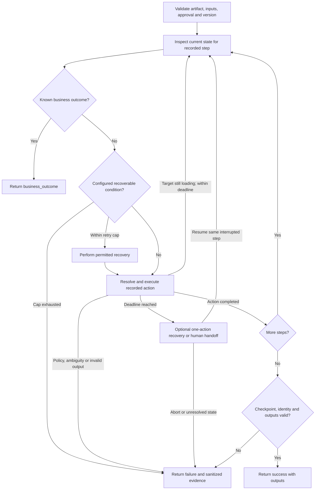
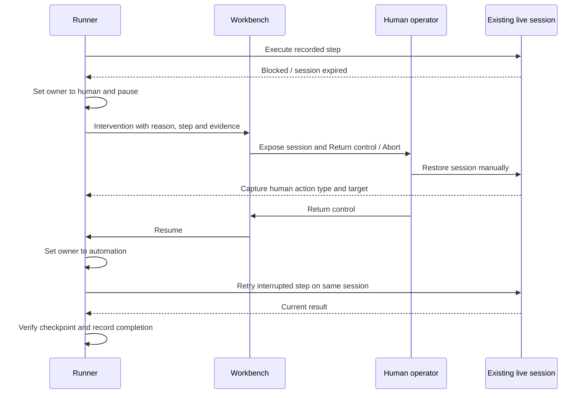

# Architecture

Relay separates discovery, a typed capability, and deterministic execution. A local LLM receives a redacted observation of a live UI and selects one currently available action. It never receives the member identifier: a `member_id` binding supplies it at execution. After a verified successful run, the recorder emits a versioned capability independently of the model transcript. Replay interprets that artifact without importing or calling a model unless the operator explicitly selects the separate assisted-recovery mode.

A shared TypeScript core runs in the browser. A `Surface` interface provides observe, act, identity, checkpoint and evidence operations. `BrowserSurface` traverses nested same-origin frames and operates actual DOM controls. The target is a functioning local banking mock with table layouts, runtime states, two institutional variants, and no automation API or test IDs. The CLI drives the workbench through Playwright; its injected bridge transports only model decisions to a loopback MLX/Ollama server. It does not bypass the target UI. This architecture makes the entire public demo deployable as static files, with no application login, paid backend, or remote database. The browser stores only the capability and its local review history; run outputs remain in memory and downloadable evidence is redacted.

The two runner nodes are modes of the same `Runner` class, not separate services. The diagram separates responsibilities: only discovery asks the model for the next business action. Normal replay follows the stored contract. The optional recovery mode introduces one separately reported model decision at an explicit failure boundary.

The concrete workflow is search → member details → savings account → balance extraction. Its execution is:

1. The workbench validates configuration, acquires its session lock and opens the selected target variant. A second invocation while the session is busy is rejected.
2. Discovery validates the goal and member parameter. The surface returns sanitized screen text plus numbered visible controls. The model chooses one available action; the runner validates that choice and the adapter checks policy before interacting with the UI.
3. Each new screen is observed again. Successful extraction must also pass the final screen and member-identity checks. Only then is a capability emitted. The committed discovery used five genuine model decisions.
4. Replay accepts the saved capability and a new member parameter. It follows the recorded operations, evaluates outcomes and recoveries, then returns the declared outputs after the same checkpoint checks. This path requires neither a model download nor a model server.
5. Events appear in the timeline during execution. Exported evidence passes through redaction; the reusable capability stores bindings and control names rather than the member or balance used in the run.

| Choice | Reason and trade-off |
| --- | --- |
| Shared interpreter in the browser | Makes the deployed demonstration directly usable and keeps UI, CLI and generated code on one execution path; confines direct target access to same-origin frames. |
| Local model inference | Reproduces real discovery without hosted inference credentials; model downloads, hardware requirements and startup latency remain visible constraints. |
| UI control names and table labels | Works with this legacy-style surface without test IDs; ambiguous matches stop instead of guessing. |
| Static hosting and browser-local state | Keeps setup small and inspectable; does not provide centralized scheduling, cross-device storage or institutional access control. |
| One read-only business capability | Allows thorough validation of inputs, identity and outputs; arbitrary task types need their own contract. |

Implementation entry points: [runner](core/engine.ts), [contracts](core/schema.ts), [surface adapter](core/surface.ts), [model adapter](core/models.ts), [workbench](components/relay/workbench.tsx), and [CLI](scripts/cli.ts).

# Artifact schema

The Zod-validated contract contains schema and capability versions, identity, vendor, compatible surface versions, typed parameters, typed outputs, actions, locators, final checkpoint, known business outcomes, deterministic recovery handlers, provenance, and local approval/stability history. Supported operations are fill, click and read; arbitrary code and arbitrary data paths are excluded. Parameters replace concrete member values; the reusable artifact never stores the training identifier or observed balance.

Discovery references are ephemeral numbered controls. Recording resolves each to a stable control/field name or table label. A locator must resolve to exactly one visible match; ambiguity is an error. The declared success condition requires Account overview, a parsable currency/amount, and the same member identifier supplied by the caller. The balance profile is deliberately narrow and its schema explicit. Supporting another business task means defining its typed output/checkpoint profile, not pretending every goal fits this contract. Exported runnable code invokes the shared interpreter so policy, waits, outcomes and checkpoint behavior are preserved instead of being duplicated in a fragile generated script.

The [complete saved artifact](evidence/capability.json) is the executable contract. Its main fields serve different purposes:

| Field | Meaning |
| --- | --- |
| `schema_version` / `version` | Separates the JSON format version from the capability revision. |
| `id`, `vendor`, `supported_versions` | Identifies the callable workflow and the target product versions accepted before replay. |
| `inputs` / `outputs` | Declares a five-digit string member parameter and numeric balance plus currency result. |
| `steps` | Ordered typed operations; filling uses `input: member_id`, and extraction uses `output: balance`. |
| `checkpoint` | Requires the account overview and a member identity matching the invocation. |
| `outcomes` / `recoveries` | Separates legitimate business answers from specifically permitted bounded repair actions. |
| `provenance` | Links the artifact to the model, creation time and actual discovery run. |
| `approval` | Records device-local validation counts and review state; it is not a signed authorization. |

The model discovers the successful action sequence. The application supplies the narrow capability profile, output schema and known recovery rules; these are not claimed to be inferred automatically. Changing `member_id` changes the input binding, not the recorded steps. The raw prompts and responses remain separate in [model exchanges](evidence/discover/model-exchanges.json), allowing a reviewer to distinguish what the model decided from what the executor enforces.

# Determinism & error handling

Replay uses ordered recorded operations, exact target names, bounded condition polling, a capped recovery counter and explicit checkpoints. Stable logic does not imply static bank data: returned values reflect the current screen. Expected business outcomes such as MEMBER_NOT_FOUND are separate from failures. Known transient connection errors and notices trigger configured retry/dismiss actions; slow loads are polled until the step deadline. Permission denial, unsupported versions, ambiguous controls, unsafe actions and unknown states stop or escalate. Diagnostic failures include step, expected state and redacted observed state. Side-effecting business actions are not automatically retried; the implemented workflow is read-only.

Each result reports model-call count and whether assisted recovery occurred. The optional assisted path permits one model-selected click from a short explicit recovery-control allowlist, re-enters the interrupted deterministic step, and verifies the original checkpoint. It cannot silently become open-ended rediscovery. Approval requires three successful unassisted replays with no unresolved failures. Five-run stability evidence is an observed sample, not a production reliability estimate. File imports reset approval and validation counts to draft. Programmatic invocation reuses review state only when the supplied contract exactly matches the device-local artifact; caller-supplied review metadata cannot grant approval. API snapshots are cloned. The local operator remains the trust boundary in this demonstration.

Default policy allows 25 steps, a six-second per-step waiting window and at most two deterministic retries. Discovery additionally checks an overall three-minute limit between iterations and a configurable model-response timeout capped at one minute, shared by discovery and assisted recovery. Cancellation rejects pending decisions and prevents late answers from taking actions; it does not forcibly terminate the underlying inference computation. Human handoff suspends automation rather than starting another invocation. Replay creates a fresh waiting window on handback and refuses a second unresolved handoff at the same step. These are execution limits for the prototype, not service-level guarantees.

Examples in the [integrated verification results](evidence/verification.json) include `MEMBER_NOT_FOUND` as a business outcome, successful retry after a transient error, `AMBIGUOUS_TARGET` as a hard failure, and `PERMISSION_DENIED` when no operator is available. The unknown application error is reported with the blocked step and sanitized screen; it is not relabeled as a successful extraction. Generated automation was also executed independently with zero model calls.

# Heterogeneity & multi-tenant

The interpreter depends on `Surface`, not DOM libraries. A desktop adapter would translate the same abstract operations into accessibility controls, and introduce a versioned locator union for accessibility paths and visual anchors. A screenshot-only adapter needs deterministic template/OCR targeting, calibrated coordinates, explicit ambiguity thresholds and stable evidence masking; it is not implemented here. The current adapter traverses frames and can associate fields with table labels. It does not claim to control arbitrary cross-origin targets from a public webpage. A production browser worker or extension would provide that privileged boundary while preserving the interpreter contract.

Northstar v1.0 and Harbor v1.1 share the vendor workflow. A tenant binding changes the search control name; input values remain parameterized. The same discovered artifact runs on both and the declared version check rejects an unknown version. Production reuse would key an immutable base capability by vendor/product/version and use reviewed tenant overlays for entrypoints, locator differences and enabled operations. Canary replays and checkpoint failures would quarantine an incompatible overlay and require revalidation; broad wildcard fallbacks would not hide drift. Thousands of tenants imply credential/session isolation and scheduling, but those services would not improve this small vertical slice.

# Escalation & handoff

The runner owns one session and exposes automation, human and stopped states. A blocked run emits an intervention with the goal/capability context available in the run, current step, reason and a redacted snapshot. Automation suspends on a promise and the UI removes its interaction shield. The person operates the existing nested-frame session; document listeners capture the types and targets of their actions while redacting input values. Return control transfers ownership and retries the interrupted step against current state, then checks the original success contract. A second unresolved state after handback fails deliberately. Abort wakes the paused runner and terminates it.

A per-session invocation lock rejects concurrent runs. Discovery also supports intervention and re-observes after handback instead of assuming a human solved the goal. Invalid choices and repeated no-progress actions are bounded. Headless CLI execution does not wait indefinitely for an absent person: it returns a failure with evidence; headed execution exposes the real takeover. The submitted automated handoff test uses actual browser clicks as the operator stand-in and verifies the target frame URL did not change. A distributed operator console would need ownership leases, authenticated claims, disconnect expiry and durable audit records; its multi-user implementation is intentionally outside this scope.

Ownership is explicit: `automation` may issue actions, `human` owns the session while the runner is paused, and `stopped` is terminal. The workbench resets the target when a new run begins; returning control during an intervention does **not** reset or replace that target. Event listeners capture manual clicks and input events while discarding typed values. Abort releases the waiting runner, so cancellation cannot leave an invocation permanently holding the session lock. The [handoff evidence](evidence/handoff/run.json) preserves both sides of this transfer in one run.

# Safety

A strictly validated route/action policy applies inside the surface adapter for both modes. Every frame must have an accessible document on the pinned origin and an exact permitted path; suffix matches cannot expand the boundary. Read operations enforce the same route checks. Uniquely resolved targets must be visible, enabled, of the expected element type, and named in the workflow control allowlist. Password fields, unknown controls, links and form-submitting buttons are rejected. Risky controls such as Submit transfer are blocked before clicking, including in imported artifacts. Model choices are constrained to observed controls and checked for action/target compatibility. Page text is treated as untrusted data, and decisions are not executable code. Parameters are validated before target actions; the UI exposes only synthetic records and no real authentication or PII.

Sensitive DOM regions are masked before model observation. A central redaction function handles evidence and log persistence; caller outputs are redacted when exported. Failure evidence includes a sanitized UI snapshot, and the CLI captures masked screenshots. Regex redaction and marked regions suffice for this known synthetic surface, not arbitrary institutional data: production requires field-level data classification, deny-by-default capture, retention controls and tested masking for each adapter. LocalStorage is not a secret vault and contains no credentials. Client-side approval can be edited by the local user; authenticated reviewers, server policy enforcement and artifact signatures would be required before institutional deployment.

Static production HTML adds a Content Security Policy with hashes for the banking scripts, same-origin frames and media, and restricted model-download origins. Additional security headers are emitted for hosts supporting `_headers`; GitHub Pages does not apply that file. The CLI model bridge is exposed only for discovery or explicitly assisted runs, validates the calling main-frame origin/path, restricts the model endpoint to credential-free HTTP loopback URLs, and rejects redirects. The browser API refuses external resets during owned sessions. Regression evidence and remaining trust assumptions are documented in [Security](docs/SECURITY.md).

# Cuts

Implemented: one complete multi-step balance workflow, genuine local-model discovery evidence, a typed reusable artifact, deterministic replay with new inputs and outputs, known outcomes, bounded recoveries, hard failures, live-session takeover, privacy-aware evidence, two tenant variants, capability invocation, runnable code export, approval scoring, one-action assisted recovery, stability reporting, a public no-login product and a 4K recorded walkthrough lasting 1:45.

Deliberately omitted: real financial systems/data, irreversible business workflows, distributed queues, production identity/secret management, desktop execution, arbitrary cross-origin browser control, and a multi-user operator console. The narrow task profile makes correctness inspectable. Local model performance and browser GPU availability vary; the CLI and committed replay artifact are reproducible alternatives. Native WebMCP registration is feature-detected; the portable catalog/invocation interface is the baseline. Next work would harden signed artifact promotion, tenant isolation, adaptive-but-deterministic locator adapters, semantic policy metadata, and richer failure injection before expanding task breadth.

All six optional extensions reuse the same core: callable catalog/invocation, runnable code export, confidence and approval, bounded model recovery, two-tenant reuse, and five-run stability. Their implementation and proof are mapped in [the requirements audit](docs/REQUIREMENTS.md). The brief recommends one or two optional extensions; the complete set follows the additional request to include all of them. The visual product and narrated video supplement the core engineering submission.

Verification combines 23 unit tests, real browser execution across 20 integrated cases including one local-model assisted recovery, genuine discovery evidence from local MLX and browser WebGPU, generated-code execution, 12 focused browser security checks, and separate responsive/color checks. Expected failures count as passing checks only when the verifier confirms the intended failure behavior. These tests establish the demonstrated workflow's behavior; they do not establish production readiness for banking systems.
